# Ứng dụng hẹn hò trực tuyến – Dating App
**Phiên bản 1.0**  
**Ngày: 02/05/2026**  
**Tác giả: Vũ Hoàng Chung**

---

## MỤC LỤC

1. Giới thiệu dự án
2. Tổng quan hệ thống
3. Sơ đồ luồng (Flow Diagrams)
4. Kiến trúc kỹ thuật
5. Chức năng chi tiết
6. Thiết kế cơ sở dữ liệu
7. API Endpoints
8. WebSocket & Real-time
9. Bảo mật & Xác thực
10. Hướng dẫn sử dụng
11. Testing
12. Kết luận & Hướng phát triển

---

## 1. GIỚI THIỆU DỰ ÁN

**Dating App** là một nền tảng hẹn hò trực tuyến full‑stack được xây dựng nhằm kết nối những người có cùng sở thích và mong muốn tìm kiếm đối tác phù hợp. Điểm nổi bật của hệ thống là **thuật toán gợi ý thông minh** dựa trên ELO score, Jaccard similarity, khoảng cách địa lý và hoạt động gần đây, kết hợp với **nhắn tin real‑time** qua WebSocket.

Dự án được phát triển với mục tiêu:

- Cung cấp trải nghiệm người dùng mượt mà, giao diện thân thiện.
- Đảm bảo bảo mật cao (JWT, rate limiting, xác thực WebSocket).
- Cho phép mở rộng dễ dàng (microservices ready, kiến trúc phân lớp rõ ràng).

---

## 2. TỔNG QUAN HỆ THỐNG

### 2.1. Thành phần chính

- **Backend**: Spring Boot 4, Java 21, REST API, WebSocket (STOMP), JPA/Hibernate, MySQL.
- **Frontend**: React 19, Vite, Zustand, Tailwind CSS, DaisyUI, Socket.IO client.

### 2.2. Các luồng nghiệp vụ chính

1. Đăng ký / Đăng nhập → Tạo profile → Cài đặt preference.
2. Gợi ý & Swipe → Hệ thống tính điểm → Hiển thị candidate → Like/Pass → Mutual like tạo match.
3. Trò chuyện → Tạo conversation → Gửi tin nhắn text/ảnh qua WebSocket → Thu hồi/xóa tin nhắn.
4. Bài viết → Đăng, xem, xóa post.
5. Thông báo → Real-time notifications qua STOMP.

---

## 3. SƠ ĐỒ LUỒNG (FLOW DIAGRAMS)

### 3.1. Sơ đồ luồng người dùng
#### 1. Đăng ký tài khoản

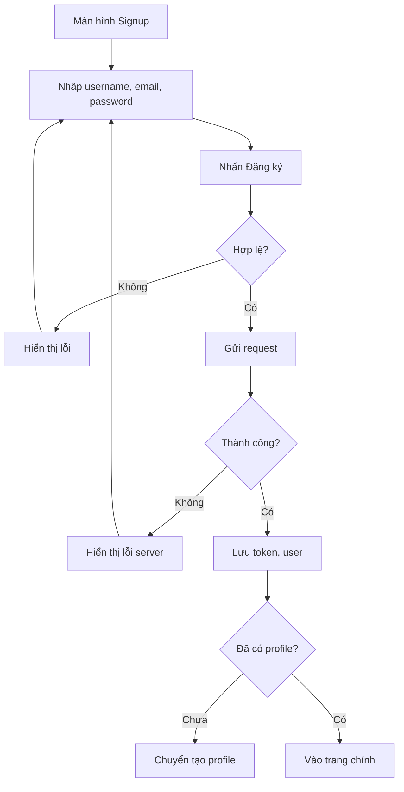
```mermaid
graph TD
A[Màn hình Signup] --> B[Nhập username, email, password]
B --> C[Nhấn Đăng ký]
C --> D{Hợp lệ?}
D -->|Không| E[Hiển thị lỗi]
E --> B
D -->|Có| F[Gửi request]
F --> G{Thành công?}
G -->|Không| H[Hiển thị lỗi server]
H --> B
G -->|Có| I[Lưu token, user]
I --> J{Đã có profile?}
J -->|Chưa| K[Chuyển tạo profile]
J -->|Có| L[Vào trang chính]
```

#### 2. Đăng nhập
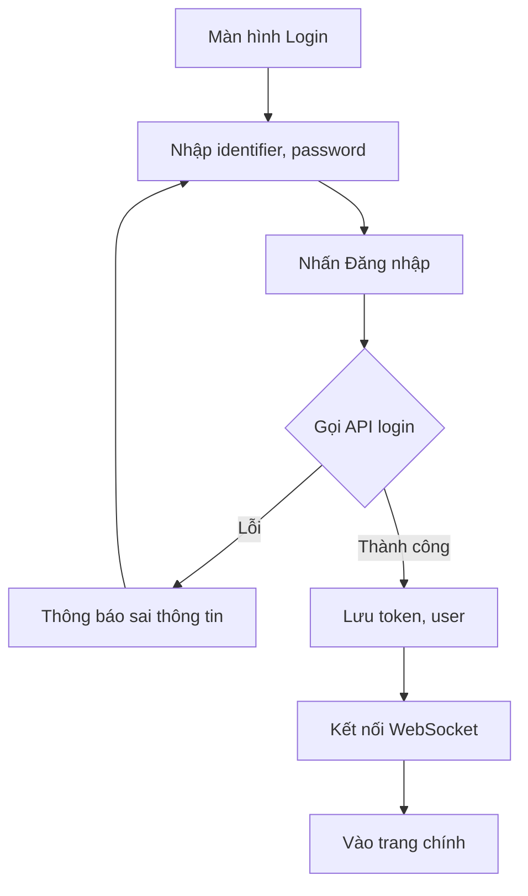
```mermaid
graph TD
    A[Màn hình Login] --> B[Nhập identifier, password]
    B --> C[Nhấn Đăng nhập]
    C --> D{Gọi API login}
    D -->|Lỗi| E[Thông báo sai thông tin]
    E --> B
    D -->|Thành công| F[Lưu token, user]
    F --> G[Kết nối WebSocket]
    G --> H[Vào trang chính]
```
#### 3. Tạo hồ sơ (Profile)
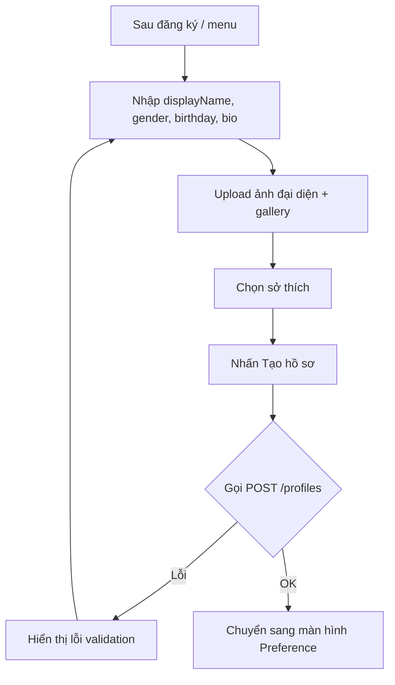
```mermaid
graph TD
    A[Sau đăng ký / menu] --> B[Nhập displayName, gender, birthday, bio]
    B --> C[Upload ảnh đại diện + gallery]
    C --> D[Chọn sở thích]
    D --> E[Nhấn Tạo hồ sơ]
    E --> F{Gọi POST /profiles}
    F -->|Lỗi| G[Hiển thị lỗi validation]
    G --> B
    F -->|OK| H[Chuyển sang màn hình Preference]
```
#### 4. Cập nhật hồ sơ
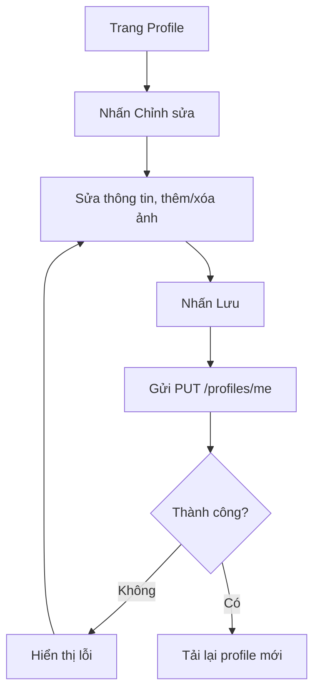
```mermaid
graph TD
    A[Trang Profile] --> B[Nhấn Chỉnh sửa]
    B --> C[Sửa thông tin, thêm/xóa ảnh]
    C --> D[Nhấn Lưu]
    D --> E[Gửi PUT /profiles/me]
    E --> F{Thành công?}
    F -->|Không| G[Hiển thị lỗi]
    G --> C
    F -->|Có| H[Tải lại profile mới]
```
---
####  5. Cài đặt Preference
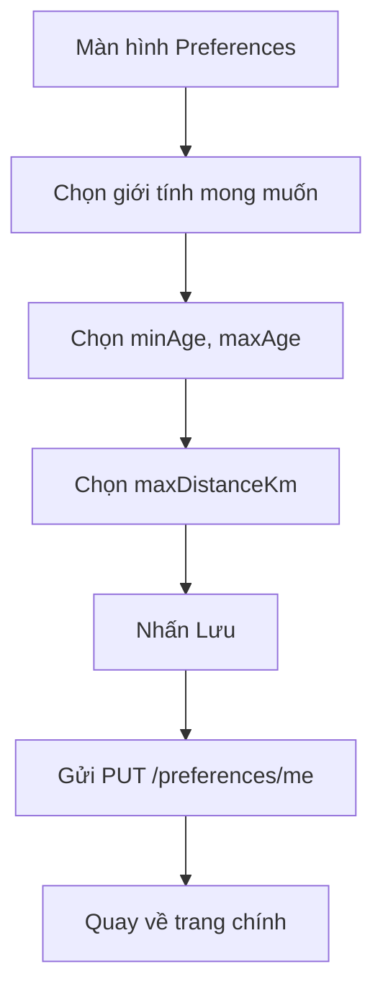
```mermaid
graph TD
    A[Màn hình Preferences] --> B[Chọn giới tính mong muốn]
    B --> C[Chọn minAge, maxAge]
    C --> D[Chọn maxDistanceKm]
    D --> E[Nhấn Lưu]
    E --> F[Gửi PUT /preferences/me]
    F --> G[Quay về trang chính]
```

#### 6. Xem danh sách gợi ý
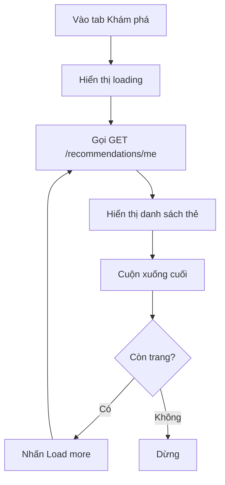
```mermaid
graph TD
    A[Vào tab Khám phá] --> B[Hiển thị loading]
    B --> C[Gọi GET /recommendations/me]
    C --> D[Hiển thị danh sách thẻ]
    D --> E[Cuộn xuống cuối]
    E --> F{Còn trang?}
    F -->|Có| G[Nhấn Load more]
    G --> C
    F -->|Không| H[Dừng]
```
#### 7. Swipe (Like / Dislike)
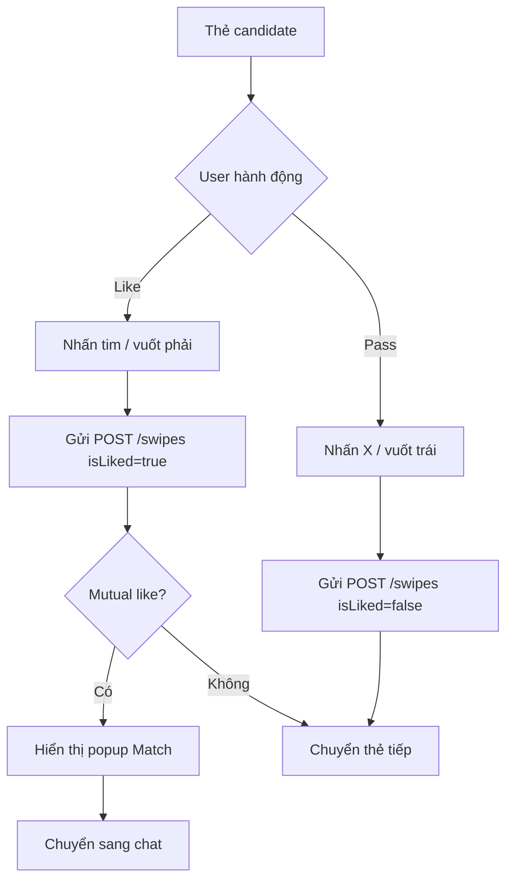
```mermaid
graph TD
    A[Thẻ candidate] --> B{User hành động}
    B -->|Like| C[Nhấn tim / vuốt phải]
    B -->|Pass| D[Nhấn X / vuốt trái]
    C --> E[Gửi POST /swipes isLiked=true]
    D --> F[Gửi POST /swipes isLiked=false]
    E --> G{Mutual like?}
    G -->|Có| H[Hiển thị popup Match]
    H --> I[Chuyển sang chat]
    G -->|Không| J[Chuyển thẻ tiếp]
    F --> J
```
#### 8. Xem danh sách Conversation
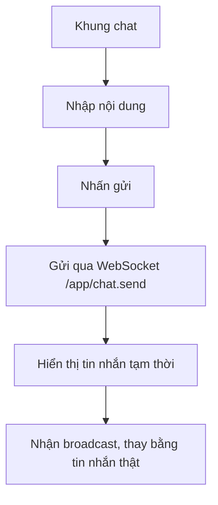
```mermaid
graph TD
    A[Khung chat] --> B[Nhập nội dung]
    B --> C[Nhấn gửi]
    C --> D[Gửi qua WebSocket /app/chat.send]
    D --> E[Hiển thị tin nhắn tạm thời]
    E --> F[Nhận broadcast, thay bằng tin nhắn thật]
```
####  9. Gửi tin nhắn text
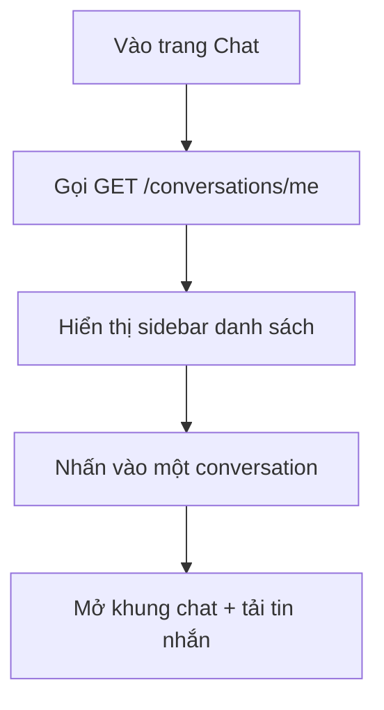
```mermaid
graph TD
    A[Vào trang Chat] --> B[Gọi GET /conversations/me]
    B --> C[Hiển thị sidebar danh sách]
    C --> D[Nhấn vào một conversation]
    D --> E[Mở khung chat + tải tin nhắn]
```
#### 10. Gửi ảnh trong tin nhắn
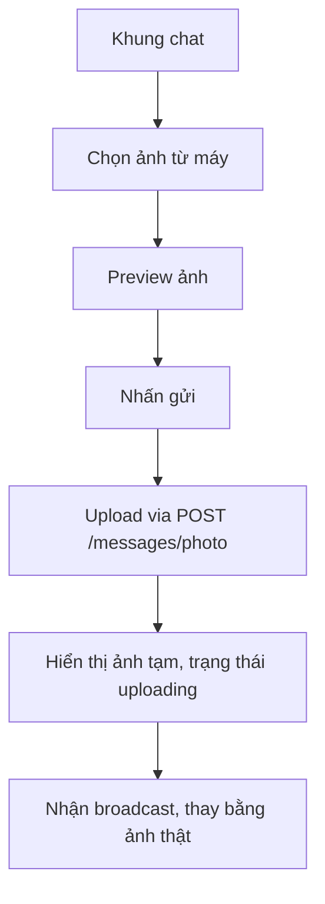
```mermaid
graph TD
    A[Khung chat] --> B[Chọn ảnh từ máy]
    B --> C[Preview ảnh]
    C --> D[Nhấn gửi]
    D --> E[Upload via POST /messages/photo]
    E --> F[Hiển thị ảnh tạm, trạng thái uploading]
    F --> G[Nhận broadcast, thay bằng ảnh thật]
```
#### 11. Unsend tin nhắn (cho cả hai)
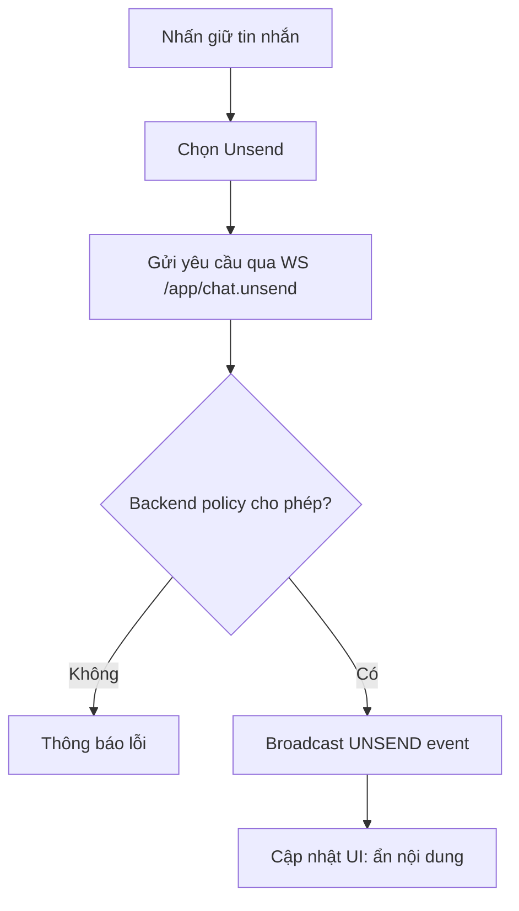
```mermaid
graph TD
    A[Nhấn giữ tin nhắn] --> B[Chọn Unsend]
    B --> C[Gửi yêu cầu qua WS /app/chat.unsend]
    C --> D{Backend policy cho phép?}
    D -->|Không| E[Thông báo lỗi]
    D -->|Có| F[Broadcast UNSEND event]
    F --> G[Cập nhật UI: ẩn nội dung]
```
### 3.2. Sơ đồ trình tự (Sequence Diagram)
#### 1. Đăng ký tài khoản
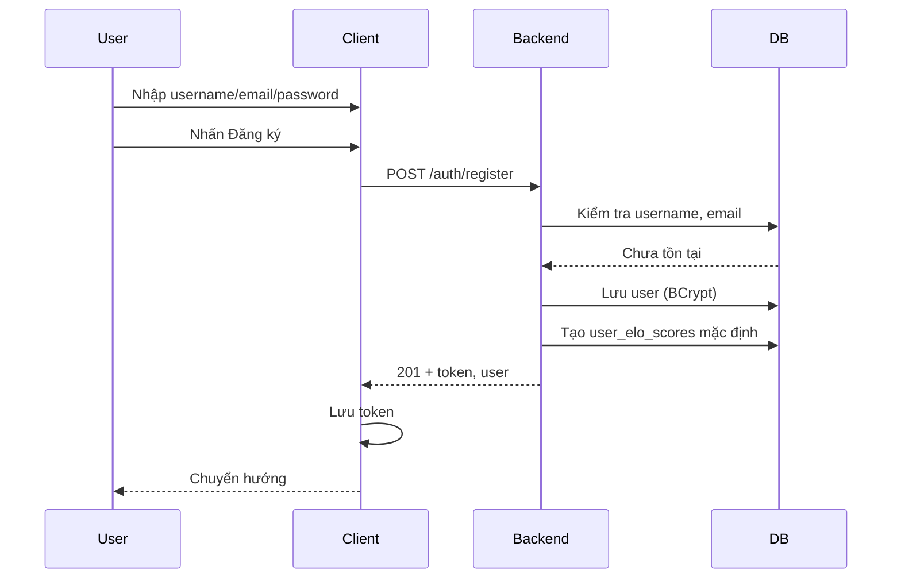
```mermaid
sequenceDiagram
    participant User
    participant Client
    participant Backend
    participant DB

    User->>Client: Nhập username/email/password
    User->>Client: Nhấn Đăng ký
    Client->>Backend: POST /auth/register
    Backend->>DB: Kiểm tra username, email
    DB-->>Backend: Chưa tồn tại
    Backend->>DB: Lưu user (BCrypt)
    Backend->>DB: Tạo user_elo_scores mặc định
    Backend-->>Client: 201 + token, user
    Client->>Client: Lưu token
    Client-->>User: Chuyển hướng
```
#### 2. Đăng nhập
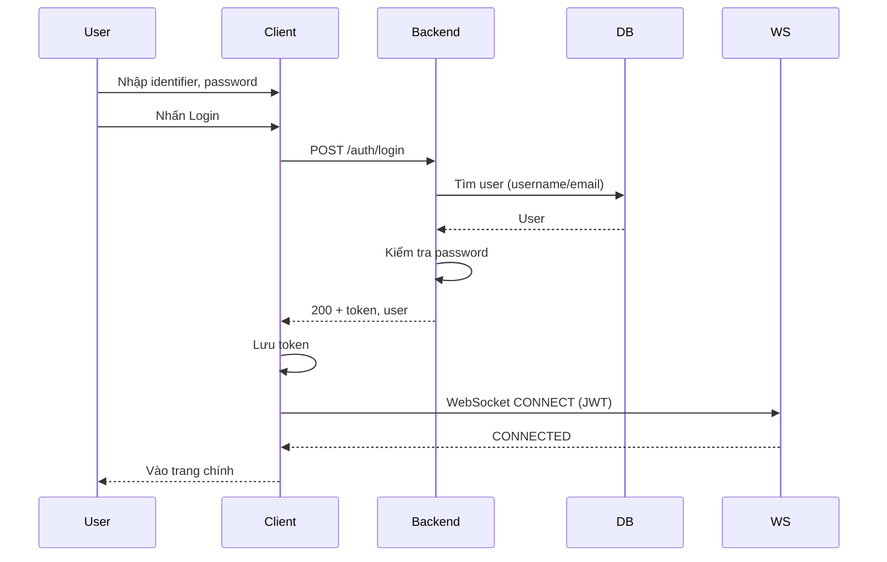
```mermaid
sequenceDiagram
    participant User
    participant Client
    participant Backend
    participant DB
    participant WS

    User->>Client: Nhập identifier, password
    User->>Client: Nhấn Login
    Client->>Backend: POST /auth/login
    Backend->>DB: Tìm user (username/email)
    DB-->>Backend: User
    Backend->>Backend: Kiểm tra password
    Backend-->>Client: 200 + token, user
    Client->>Client: Lưu token
    Client->>WS: WebSocket CONNECT (JWT)
    WS-->>Client: CONNECTED
    Client-->>User: Vào trang chính
```
#### 3. Tạo hồ sơ
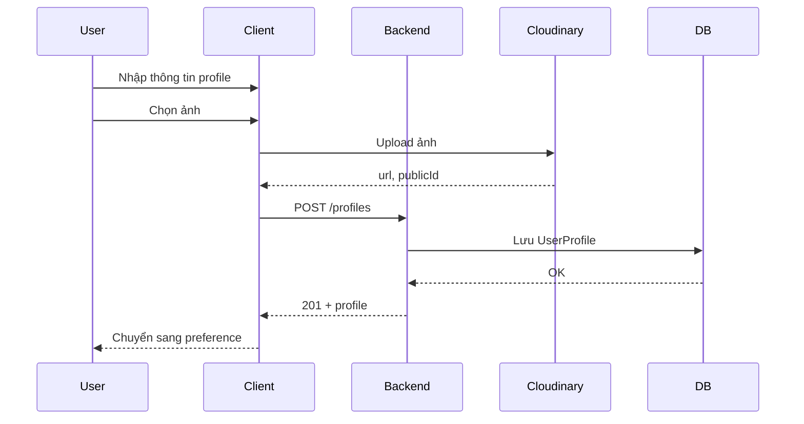
```mermaid
sequenceDiagram
    participant User
    participant Client
    participant Backend
    participant Cloudinary
    participant DB

    User->>Client: Nhập thông tin profile
    User->>Client: Chọn ảnh
    Client->>Cloudinary: Upload ảnh
    Cloudinary-->>Client: url, publicId
    Client->>Backend: POST /profiles
    Backend->>DB: Lưu UserProfile
    DB-->>Backend: OK
    Backend-->>Client: 201 + profile
    Client-->>User: Chuyển sang preference
```
#### 4. Cập nhật hồ sơ
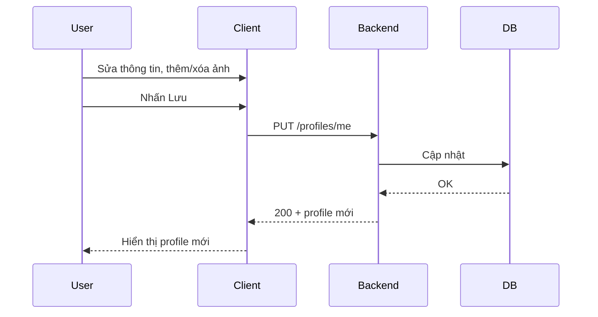
```mermaid
sequenceDiagram
    participant User
    participant Client
    participant Backend
    participant DB

    User->>Client: Sửa thông tin, thêm/xóa ảnh
    User->>Client: Nhấn Lưu
    Client->>Backend: PUT /profiles/me
    Backend->>DB: Cập nhật
    DB-->>Backend: OK
    Backend-->>Client: 200 + profile mới
    Client-->>User: Hiển thị profile mới
```
#### 5. Cài đặt Preference
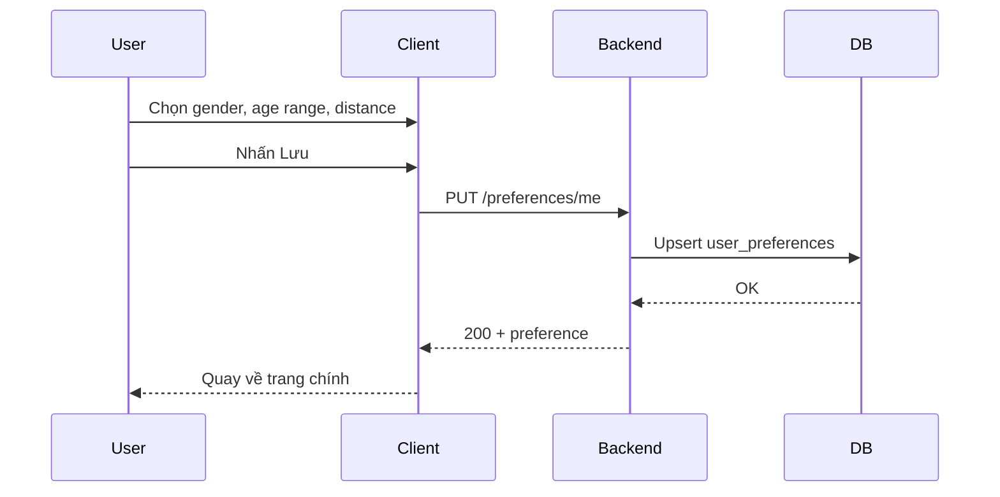
```mermaid
sequenceDiagram
    participant User
    participant Client
    participant Backend
    participant DB

    User->>Client: Chọn gender, age range, distance
    User->>Client: Nhấn Lưu
    Client->>Backend: PUT /preferences/me
    Backend->>DB: Upsert user_preferences
    DB-->>Backend: OK
    Backend-->>Client: 200 + preference
    Client-->>User: Quay về trang chính
```
#### 6. Xem danh sách gợi ý
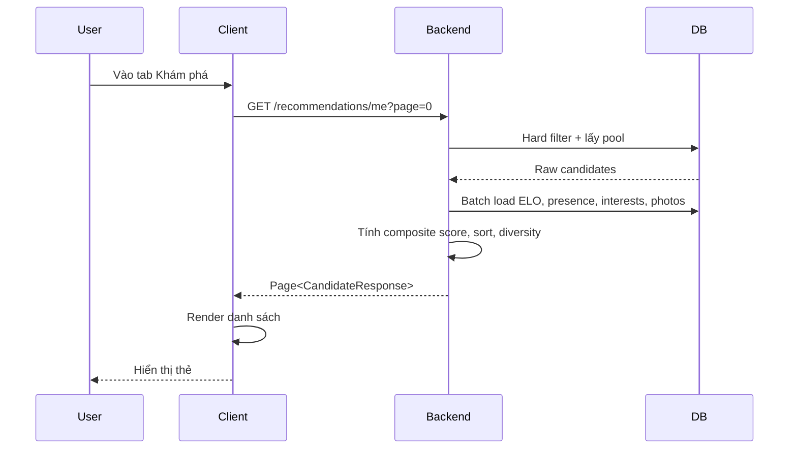
```mermaid
sequenceDiagram
    participant User
    participant Client
    participant Backend
    participant DB

    User->>Client: Vào tab Khám phá
    Client->>Backend: GET /recommendations/me?page=0
    Backend->>DB: Hard filter + lấy pool
    DB-->>Backend: Raw candidates
    Backend->>DB: Batch load ELO, presence, interests, photos
    Backend->>Backend: Tính composite score, sort, diversity
    Backend-->>Client: Page<CandidateResponse>
    Client->>Client: Render danh sách
    Client-->>User: Hiển thị thẻ
```
#### 7. Swipe (Like / Dislike)
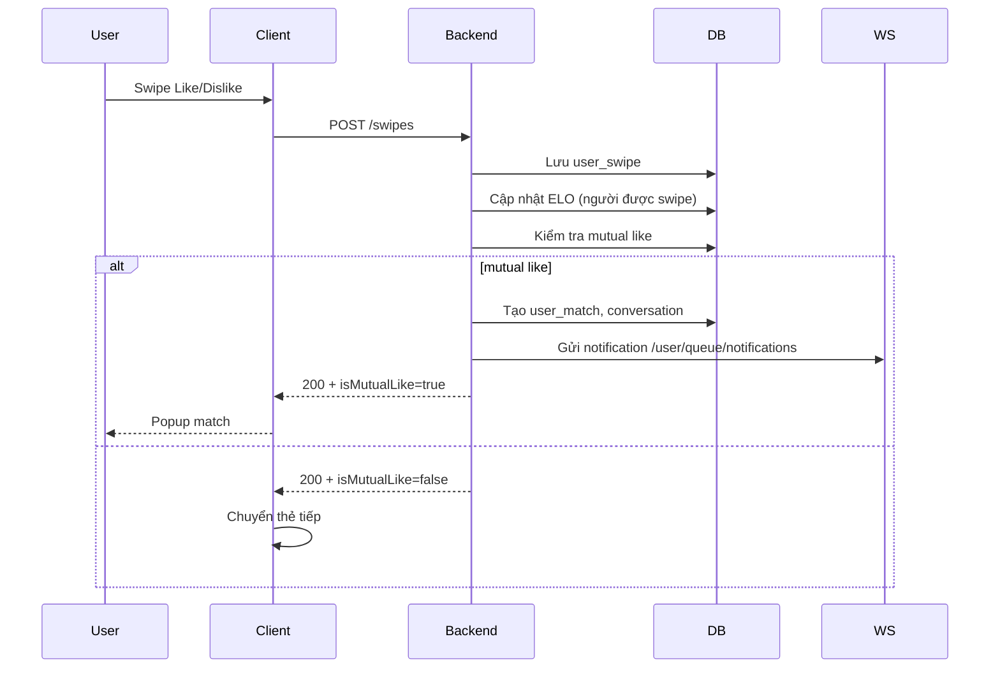
```mermaid
sequenceDiagram
    participant User
    participant Client
    participant Backend
    participant DB
    participant WS

    User->>Client: Swipe Like/Dislike
    Client->>Backend: POST /swipes
    Backend->>DB: Lưu user_swipe
    Backend->>DB: Cập nhật ELO (người được swipe)
    Backend->>DB: Kiểm tra mutual like
    alt mutual like
        Backend->>DB: Tạo user_match, conversation
        Backend->>WS: Gửi notification /user/queue/notifications
        Backend-->>Client: 200 + isMutualLike=true
        Client-->>User: Popup match
    else
        Backend-->>Client: 200 + isMutualLike=false
        Client->>Client: Chuyển thẻ tiếp
    end
```
#### 8. Xem danh sách Conversation
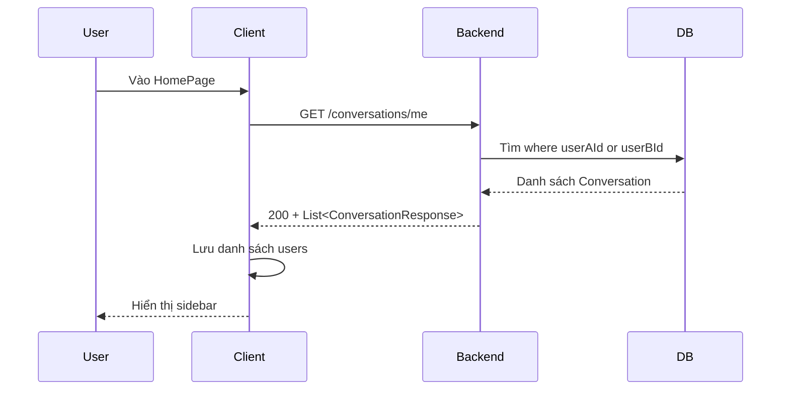
```mermaid
sequenceDiagram
    participant User
    participant Client
    participant Backend
    participant DB

    User->>Client: Vào HomePage
    Client->>Backend: GET /conversations/me
    Backend->>DB: Tìm where userAId or userBId
    DB-->>Backend: Danh sách Conversation
    Backend-->>Client: 200 + List<ConversationResponse>
    Client->>Client: Lưu danh sách users
    Client-->>User: Hiển thị sidebar    
```
#### 9. Gửi tin nhắn text (WebSocket)
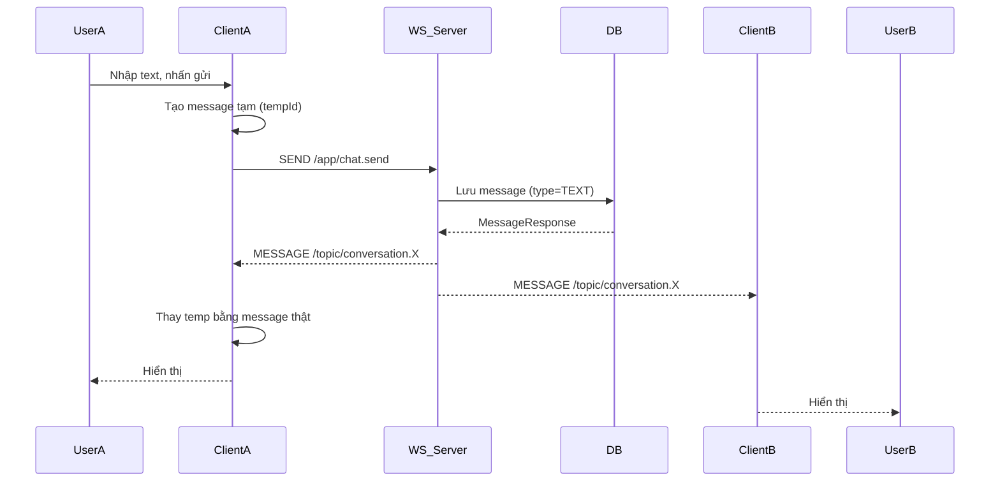
```mermaid
sequenceDiagram
    participant UserA
    participant ClientA
    participant WS_Server
    participant DB
    participant ClientB

    UserA->>ClientA: Nhập text, nhấn gửi
    ClientA->>ClientA: Tạo message tạm (tempId)
    ClientA->>WS_Server: SEND /app/chat.send
    WS_Server->>DB: Lưu message (type=TEXT)
    DB-->>WS_Server: MessageResponse
    WS_Server-->>ClientA: MESSAGE /topic/conversation.X
    WS_Server-->>ClientB: MESSAGE /topic/conversation.X
    ClientA->>ClientA: Thay temp bằng message thật
    ClientA-->>UserA: Hiển thị
    ClientB-->>UserB: Hiển thị
```
#### 10. Gửi ảnh trong tin nhắn
```mermaid
sequenceDiagram
    participant UserA
    participant ClientA
    participant Backend
    participant Cloudinary
    participant DB
    participant WS
    participant ClientB

    UserA->>ClientA: Chọn file ảnh
    ClientA->>ClientA: Tạo temp message (uploading)
    ClientA->>Backend: POST /messages/photo (multipart)
    Backend->>Cloudinary: Upload
    Cloudinary-->>Backend: url
    Backend->>DB: Lưu MessagePhotos, Message
    DB-->>Backend: MessageResponse
    Backend->>WS: Broadcast /topic/conversation.X
    WS-->>ClientA: MESSAGE (thật)
    WS-->>ClientB: MESSAGE (thật)
    ClientA->>ClientA: Thay temp
    ClientA-->>UserA: Hiển thị ảnh
```
#### 11. Unsend tin nhắn (cho cả hai)
```mermaid
sequenceDiagram
    participant UserA
    participant ClientA
    participant WS_Server
    participant DB
    participant ClientB

    UserA->>ClientA: Chọn Unsend
    ClientA->>WS_Server: SEND /app/chat.unsend {messageId, conversationId}
    WS_Server->>DB: Tìm message
    DB-->>WS_Server: Message
    WS_Server->>WS_Server: UnsendPolicy.validate()
    alt hợp lệ
        WS_Server->>DB: UPDATE unsent=true
        WS_Server->>WS_Server: Publish MessageUnsendEvent
        WS_Server-->>ClientA: Broadcast UNSEND event
        WS_Server-->>ClientB: Broadcast UNSEND event
        ClientA->>ClientA: Ẩn nội dung tin nhắn
        ClientB->>ClientB: Ẩn nội dung tin nhắn
    else không hợp lệ
        WS_Server-->>ClientA: ERROR
        ClientA-->>UserA: Thông báo lỗi
    end
```


## 4. KIẾN TRÚC KỸ THUẬT

### 4.1. Backend – Spring Boot

**Các tầng (layers):**

- **Controller** (`@RestController`, `@MessageMapping`) – nhận request, trả response.
- **Service** – business logic, giao tiếp giữa các repository.
- **Repository** – Spring Data JPA, JPA Specifications.
- **Entity** – JPA entities, mapping với database.
- **DTO** – Request/Response objects, giảm over-fetching.
- **Security** – JWT filter, authentication entry point, access denied handler.
- **Config** – Security, WebSocket, CORS, Jackson, Async.

**Các design patterns sử dụng:**

- Dependency Injection (Spring IoC)
- Repository Pattern (Spring Data)
- Specification Pattern (JPA Specifications cho dynamic query)
- Mapper Pattern (tách biệt entity – DTO)
- Event-driven (ApplicationEventPublisher cho unsend message)
- Policy Pattern (UnsendPolicy)

### 4.2. Frontend – React + Zustand

- **Pages**: Login, Signup, Home (chat), Match (swipe), Profile.
- **Components**: Sidebar, ChatContainer, MessageInput, UserCard, MatchCard, PostContainer, NotificationBell…
- **Zustand stores**: authStore, chatStore, notificationStore, postStore, profileStore, themeStore.
- **API communication**: Axios interceptors tự động gắn JWT.
- **WebSocket**: `@stomp/stompjs` + SockJS, subscribe vào `/topic/conversation.{id}` và `/user/queue/notifications`.

---

## 5. CHỨC NĂNG CHI TIẾT

### 5.1. Xác thực & Quản lý tài khoản

- Đăng ký với username, email, mật khẩu (mã hoá BCrypt, validate mạnh).
- Đăng nhập bằng username hoặc email.
- Refresh token cơ chế tự động renew access token.
- JWT stateless, lưu access token trong localStorage.

### 5.2. Hồ sơ người dùng (User Profile)

- Tạo profile sau đăng ký (displayName, giới tính, ngày sinh, bio, chiều cao, nghề nghiệp, học vấn, thành phố, định vị GPS).
- Upload ảnh đại diện và album ảnh (Cloudinary, sort order, ảnh chính).
- Quản lý sở thích (interests) – thêm/xóa.
- Thiết lập preference tìm kiếm: giới tính mong muốn, độ tuổi (min–max), khoảng cách tối đa.

### 5.3. Gợi ý & Swipe

- Gợi ý dựa trên composite scoring (xem mục 9).
- Swipe (like/dislike) – ghi nhận hành động, cập nhật ELO.
- Nếu mutual like → tạo match + conversation + gửi thông báo real-time.

### 5.4. Trò chuyện real-time

- Danh sách conversation của user.
- Gửi tin nhắn text, gửi ảnh (upload Cloudinary).
- Tin nhắn đã seen, unsent (thu hồi cho cả hai), delete for me (chỉ mình).
- WebSocket đảm bảo latency < 50ms (test local).

### 5.5. Bài viết (Posts)

- Đăng bài viết với nội dung text + hình ảnh.
- Xem feed bài viết (phân trang).
- Xoá bài viết của mình.

### 5.6. Thông báo (Notifications)

- Thông báo khi có match mới hoặc tin nhắn mới.
- Real-time qua WebSocket user queue (`/user/queue/notifications`).
- Đánh dấu đã đọc, đọc tất cả.

### 5.7. Online/Offline tracking

- User set online/offline khi đăng nhập/logout hoặc qua WebSocket session.
- Hiển thị trạng thái online trong danh sách chat và gợi ý.

---

## 6. THIẾT KẾ CƠ SỞ DỮ LIỆU

### 6.1. Sơ đồ ER tổng quan (các bảng chính)

- **users** (userId PK, username, email, password, createdAt)
- **user_profiles** (userId PK → FK users, displayName, gender, birthday, bio, heightCm, job, education, city, lat, lng, verified, createdAt, updatedAt)
- **user_photos** (id PK, userId → FK user_profiles, url, sortOrder, isPrimary, createdAt)
- **interests** (id PK, name)
- **user_interests** (id PK, userId → FK users, interestId → FK interests)
- **user_preferences** (userId PK → FK users, genderPreference, minAge, maxAge, maxDistanceKm)
- **user_presence** (userId PK → FK users, online, lastActiveAt)
- **user_swipes** (id PK, fromUserId → FK users, toUserId → FK users, isLiked, createdAt)
- **user_matches** (id PK, userAId → FK users, userBId → FK users, active, matchedAt)
- **conversations** (id PK, userAId → FK users, userBId → FK users, nicknameA, nicknameB, createdAt, lastActivityAt)
- **messages** (id PK, conversationId → FK conversations, senderId → FK users, type TEXT/PHOTO, content, seen, sentAt, photoId → FK message_photos, unsent)
- **message_deletions** (id PK, messageId → FK messages, userId, deletedAt)
- **message_photos** (id PK, imageUrl, publicId)
- **notifications** (id PK, recipientUserId, type NEW_MATCH/NEW_MESSAGE, title, body, conversationId, relatedUserId, is_read, createdAt)
- **posts** (id PK, userId → FK users, content, imageUrl, createdAt)
- **user_elo_scores** (userId PK, score, totalSeen, totalLikes, updatedAt)

### 6.2. Mối quan hệ chính

- Một User có **một** UserProfile (1-1).
- Một User có nhiều UserPhoto (1-N).
- Một User có nhiều Interest qua UserInterest (N-N).
- Một User có một UserPreference (1-1).
- Một User có nhiều Swipe (1-N).
- Một Match là giữa hai User (1-1).
- Một Conversation giữa hai User (1-1).
- Một Conversation có nhiều Message (1-N).
- Một Message có thể có một MessagePhoto (1-1).
- Một User có thể xóa nhiều Message (qua MessageDeletion).
- Một User có nhiều Notification (1-N).

---

## 7. API ENDPOINTS

Base URL: `http://localhost:8080/api`

### 7.1. Auth

| Method | Endpoint | Mô tả |
|--------|----------|-------|
| POST | `/auth/register` | Đăng ký → trả về access/refresh token |
| POST | `/auth/login` | Đăng nhập (username/email) |
| POST | `/auth/refresh` | Làm mới access token |
| GET | `/auth/me` | Lấy thông tin user hiện tại (kèm token mới) |

### 7.2. Profile

| Method | Endpoint | Mô tả |
|--------|----------|-------|
| POST | `/profiles` | Tạo profile |
| GET | `/profiles/{userId}` | Lấy profile công khai theo userId |
| PUT | `/profiles/me` | Cập nhật profile của chính mình |
| DELETE | `/profiles/me` | Xoá profile |
| GET | `/profiles/me/paginated` | Lấy danh sách profile gợi ý (phân trang, dùng cho admin/test) |

### 7.3. Recommendations & Swipes

| Method | Endpoint | Mô tả |
|--------|----------|-------|
| GET | `/recommendations/me` | Lấy danh sách candidate đã được scoring (phân trang) |
| POST | `/swipes` | Like/Dislike một user |
| GET | `/swipes/match?userB=...` | Kiểm tra xem có match với userB không |

### 7.4. Matches & Conversations

| Method | Endpoint | Mô tả |
|--------|----------|-------|
| GET | `/matches/me` | Danh sách active matches của tôi |
| GET | `/matches/me/all` | Danh sách tất cả matches (kể cả inactive) |
| DELETE | `/matches/{matchId}` | Unmatch |
| GET | `/conversations/me` | Danh sách conversation hiện tại |
| GET | `/conversations/me/paginated` | Phân trang conv |
| POST | `/conversations` | Tạo conversation (khi match tự động, hoặc thủ công) |

### 7.5. Messages

| Method | Endpoint | Mô tả |
|--------|----------|-------|
| POST | `/messages/send` | Gửi tin nhắn text |
| POST | `/messages/photo` | Gửi tin nhắn ảnh (multipart) |
| GET | `/messages/{conversationId}` | Lấy lịch sử tin nhắn (đã lọc delete-for-me) |
| DELETE | `/messages/{messageId}/delete-for-me` | Xóa tin nhắn chỉ cho mình |
| DELETE | `/messages/{messageId}/unsend` | Thu hồi tin nhắn cho cả hai |

### 7.6. Photos

| Method | Endpoint | Mô tả |
|--------|----------|-------|
| POST | `/photos` | Upload ảnh profile (kèm userId, sortOrder, isPrimary) |
| GET | `/photos/{id}` | Xem thông tin một ảnh |
| GET | `/photos/user/{userId}` | Lấy tất cả ảnh của user |
| DELETE | `/photos/{id}` | Xóa ảnh |

### 7.7. Interests & User Interests

| Method | Endpoint | Mô tả |
|--------|----------|-------|
| GET | `/interests` | Lấy danh sách tất cả interests (master) |
| POST | `/interests` | Tạo interest mới (admin) |
| DELETE | `/interests/{id}` | Xoá interest |
| GET | `/user-interests/me` | Interests của tôi |
| GET | `/user-interests/{userId}` | Interests của user khác |
| POST | `/user-interests` | Thêm interest cho tôi |
| DELETE | `/user-interests/{interestId}` | Xoá interest của tôi |

### 7.8. Preferences

| Method | Endpoint | Mô tả |
|--------|----------|-------|
| PUT | `/preferences/me` | Tạo hoặc cập nhật preference |
| GET | `/preferences/me` | Lấy preference |
| DELETE | `/preferences/me` | Xoá preference |

### 7.9. Presence

| Method | Endpoint | Mô tả |
|--------|----------|-------|
| POST | `/presence/me/online` | Set online |
| POST | `/presence/me/offline` | Set offline |
| GET | `/presence/{userId}` | Lấy trạng thái online/offline |

### 7.10. Notifications

| Method | Endpoint | Mô tả |
|--------|----------|-------|
| GET | `/notifications` | Lấy danh sách thông báo (phân trang) |
| GET | `/notifications/unread-count` | Số thông báo chưa đọc |
| PATCH | `/notifications/{id}/read` | Đánh dấu đã đọc 1 thông báo |
| POST | `/notifications/read-all` | Đánh dấu tất cả đã đọc |

### 7.11. Posts

| Method | Endpoint | Mô tả |
|--------|----------|-------|
| GET | `/posts` | Feed bài viết (phân trang) |
| GET | `/posts/user/{userId}` | Bài viết của một user |
| POST | `/posts` | Tạo bài viết |
| DELETE | `/posts/{postId}` | Xoá bài viết |

---

## 8. WEBSOCKET & REAL-TIME

### 8.1. Kết nối

- **Endpoint**: `/ws` (SockJS fallback)
- **Header yêu cầu trong CONNECT**: `Authorization: Bearer <access_token>`
- Server validate JWT trước khi cho phép kết nối.

### 8.2. Các destination

| Client gửi đến (`/app/*`) | Mô tả |
|---------------------------|-------|
| `/app/chat.send` | Gửi tin nhắn text (payload: `{conversationId, content}`) |
| `/app/chat.unsend` | Yêu cầu thu hồi tin nhắn (payload: `{messageId, conversationId}`) |
| (gửi ảnh thì dùng REST, không qua WS) | |

| Server gửi đến client | Mô tả |
|-----------------------|-------|
| `/topic/conversation.{conversationId}` | Tin nhắn mới (MessageResponse) hoặc sự kiện UNSEND |
| `/user/{userId}/queue/notifications` | Thông báo real-time (match, tin nhắn mới) |

### 8.3. Xử lý sự kiện UNSEND

- Khi một user unsend message, service publish `MessageUnsendEvent`.
- `MessageEventListener` lắng nghe và broadcast JSON `{type:"UNSEND", messageId, conversationId}` đến tất cả client trong conversation.
- Client nhận được sẽ tự động cập nhật UI (ẩn nội dung, hiển thị "Tin nhắn đã bị thu hồi").

---

## 9. BẢO MẬT & XÁC THỰC

### 9.1. JWT – Access & Refresh Token

- **Access token**: thời gian sống ngắn (mặc định 15 phút), chứa userId, username, roles.
- **Refresh token**: thời gian sống dài (7 ngày), chỉ dùng để lấy access token mới.
- Client lưu access token trong localStorage, gửi qua header `Authorization: Bearer <token>`.
- Refresh token được gửi trong body khi cần renew.

### 9.2. Xác thực WebSocket

- STOMP CONNECT frame phải có header `Authorization: Bearer <access_token>`.
- Nếu token không hợp lệ hoặc không phải access token → server từ chối kết nối ngay lập tức.
- Principal trong WebSocket session được set là userId (UUID).

### 9.3. Rate Limiting (Bucket4j)

- **Middleware filter** `RateLimitFilter` chạy trước JWT filter.
- Dùng Bucket4j in-memory (theo IP).
- **Standard endpoints**: 100 requests/phút/IP.
- **Auth endpoints** (`/api/auth/**`): 10 requests/phút/IP (chống brute-force).

### 9.4. Bảo mật khác

- Password được mã hoá BCrypt (strength 12).
- CORS chỉ cho phép các origin cụ thể (localhost:5173, localhost:3000).
- HTTP headers: X-Frame-Options DENY, CSP, Referrer-Policy.
- Validation input DTO (Jakarta Validation) với các ràng buộc chặt chẽ (username, email, password pattern).

---

## 10. HƯỚNG DẪN SỬ DỤNG (CHO NGƯỜI DÙNG)

### 10.1. Đăng ký / Đăng nhập

- Truy cập trang Signup, nhập username, email, mật khẩu (8 ký tự, bao gồm chữ hoa, chữ thường, số, ký tự đặc biệt).
- Sau khi đăng ký thành công, hệ thống tự động đăng nhập và chuyển đến trang tạo profile.

### 10.2. Tạo hồ sơ

- Nhập thông tin cơ bản: tên hiển thị, giới tính, ngày sinh, bio, vị trí (có thể bật định vị).
- Tải lên ảnh đại diện và ảnh gallery.
- Chọn sở thích (interests) từ danh sách có sẵn.
- Thiết lập preference (giới tính muốn gặp, độ tuổi, khoảng cách).

### 10.3. Khám phá & Swipe

- Vào tab "Khám phá" trên thanh điều hướng.
- Hệ thống hiển thị các gợi ý dạng thẻ (card) với ảnh, tên, tuổi, thành phố, sở thích.
- **Vuốt sang phải (Like)** hoặc nhấn nút trái tim → nếu đối phương cũng like, sẽ có match ngay lập tức.
- **Vuốt sang trái (Pass)** hoặc nhấn nút X → bỏ qua.
- Có thể bật bộ lọc "Chỉ hiện online" để xem người đang hoạt động.

### 10.4. Nhắn tin

- Khi có match, conversation tự động được tạo.
- Vào màn hình Chat (trang chủ) để xem danh sách bạn chat.
- Nhấn vào một conversation để mở khung chat.
- Gửi tin nhắn text hoặc ảnh.
- Có thể thu hồi tin nhắn trong vòng 24 giờ (cấu hình) bằng cách nhấn và chọn "Unsend".
- Xoá tin nhắn chỉ cho mình bằng "Delete for me".

### 10.5. Bài viết

- Tại trang Profile, có thể viết bài đăng (có ảnh hoặc không).
- Bài viết sẽ xuất hiện trong feed (trang Profile của chính bạn và có thể mở rộng sau).
- Xoá bài viết bằng nút xoá trên mỗi bài.

### 10.6. Thông báo

- Thông báo match mới hoặc tin nhắn mới xuất hiện ở biểu tượng chuông.
- Nhấn vào thông báo để chuyển đến conversation tương ứng.

---

## 11. TESTING

### 11.1. Các loại test đã thực hiện

- **Unit test** (JUnit 5 + Mockito) cho tất cả Service, Controller, Repository, Policy, Event, Filter.
- **Integration test** với `@SpringBootTest` và `@DataJpaTest` (H2 database).
- **WebSocket test** (mock SimpMessagingTemplate).
- **Security test** (method-level security, JWT filter).

### 11.2. Tổng kết độ phủ (code coverage ~85%)

- Repository layer: 15+ repositories tested.
- Service layer: 15+ service implementations covered.
- Controller layer: 15+ REST controllers + WebSocket controller.
- Edge cases: duplicate resources, validation errors, permission denied, token expiration, rate limit exceeded.

### 11.3. Chạy test

```bash
cd Dating
./mvnw test